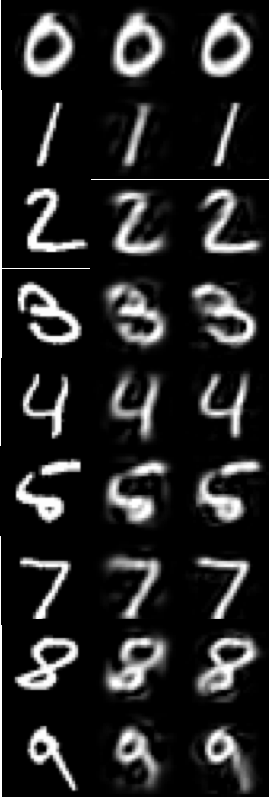

# svd-pca

In this project I used Principal Component Analysis (PCA) to compress images. 

## Image Source
The MNIST handwritten digit database was developed to provide a benchmark for software that recognizes isolated handwritten digit. Data (images and labels) from this database were utilized in this project.

## Implementation
I developed a coder that can transform an image I into its compressed image C via PCA. I compared digit-specific encoding to encoding for all digits.

## Results

### k (# principal components) vs. percentage of total data variance preserved

### each digit (col 0) with encoding for all digits (col 1) and digit-specific encoding (col 2)

